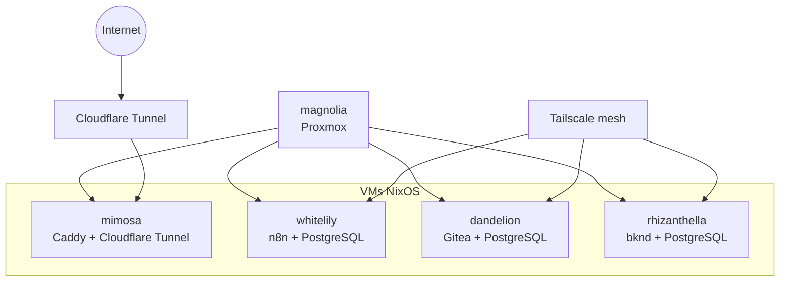

# 🏗️ nix-config

Configuration NixOS déclarative (flakes) pour une infrastructure Proxmox personnelle.

## 📋 Vue d'ensemble

Ce dépôt centralise la configuration de plusieurs VMs NixOS, des secrets via SOPS-Nix et des services auto‑hébergés. Objectif : reproductibilité, déploiement simple, documentation claire.

## 🖥️ Hôtes

| Hôte | Type | Rôle principal |
|------|------|---------------|
| **magnolia** 🌸 | Hyperviseur | Proxmox + base système |
| **mimosa** 🌼 | Site web | jeremiealcaraz.com (Caddy + Cloudflare Tunnel) |
| **whitelily** 🤍 | Automation | n8n + PostgreSQL + backups |
| **dandelion** 🌾 | Git | Gitea + PostgreSQL |
| **rhizanthella** 🌺 | BaaS | bknd + PostgreSQL |

## 🗺️ Diagramme (VMs & interactions)



## 🚀 Démarrage rapide

```bash
sudo ./scripts/install-nixos.sh          # menu interactif (cibles décrites dans scripts/install-hosts.tsv)
sudo ./scripts/install-nixos.sh --list   # affiche toutes les cibles connues (masquées incluses)
sudo ./scripts/install-nixos.sh mimosa-bootstrap
```

Les cibles visibles sont définies automatiquement à partir des dossiers `hosts/`. Les métadonnées (ordre, descriptions, alias, masquage de `marigold`, etc.) se trouvent dans `scripts/install-hosts.tsv` ; ajoutez-y une ligne pour ajouter un alias ou masquer une cible du menu sans toucher au script.

Mise a jour rapide du catalogue:
```bash
./scripts/update-install-hosts.py
./scripts/update-install-hosts.py --tailscale
```

## 💿 ISO personnalisée

```bash
cd iso/
nix build .#nixosConfigurations.iso-installer-ttyS0.config.system.build.isoImage
```

Guide complet : [docs/ISO-BUILDER.md](docs/ISO-BUILDER.md)

## 📖 Docs utiles

- [docs/BOOTSTRAP.md](docs/BOOTSTRAP.md) : création d'une VM
- [docs/DEPLOY.md](docs/DEPLOY.md) : déploiement
- [docs/SECRETS.md](docs/SECRETS.md) : workflow SOPS
- [docs/WHITELILY-N8N-SETUP.md](docs/WHITELILY-N8N-SETUP.md) : n8n

## 🔐 Secrets

SOPS‑Nix + Age, secrets chiffrés par hôte, jamais en clair.
