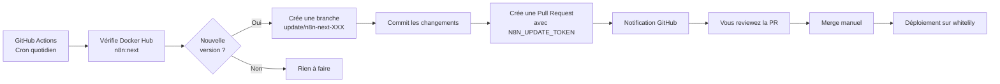

# 🔑 Configuration du Token GitHub pour les mises à jour n8n

## 📋 Vue d'ensemble

Un token GitHub (Personal Access Token) est nécessaire pour permettre au workflow GitHub Actions de créer automatiquement des Pull Requests lors de la détection de nouvelles versions de `n8n:next`.

## 🎯 Création du Token GitHub

### Étape 1 : Accéder à la page de création de token

Aller sur : **https://github.com/settings/tokens/new**

> 💡 **Astuce** : Vous pouvez aussi y accéder via Settings → Developer settings → Personal access tokens → Tokens (classic) → Generate new token

### Étape 2 : Configurer le token

Remplir les informations suivantes :

| Champ | Valeur recommandée |
|-------|-------------------|
| **Note** | `n8n auto-update workflow` |
| **Expiration** | `No expiration` (ou `1 year` selon votre politique de sécurité) |

### Étape 3 : Sélectionner les permissions (scopes)

**Cocher uniquement le scope `repo`** (Full control of private repositories)

Cela inclut automatiquement les sous-permissions suivantes :
- ✅ `repo:status` - Access commit status
- ✅ `repo_deployment` - Access deployment status
- ✅ `public_repo` - Access public repositories
- ✅ `repo:invite` - Access repository invitations
- ✅ `security_events` - Read and write security events

> ⚠️ **Important** : Même si votre repository est public, le scope `repo` complet est nécessaire pour permettre au workflow de :
> - Créer des branches
> - Pousser des commits
> - Créer des Pull Requests

### Étape 4 : Générer le token

1. Faire défiler vers le bas de la page
2. Cliquer sur le bouton vert **"Generate token"**
3. **⚠️ CRITIQUE** : La page affiche maintenant votre token (commence par `ghp_...`)
4. **COPIER IMMÉDIATEMENT** le token dans un endroit sûr
5. ⚠️ **Vous ne pourrez PLUS JAMAIS voir ce token après avoir quitté cette page !**

### Étape 5 : Sauvegarder temporairement le token

Vous aurez besoin de ce token dans quelques instants pour :
1. Le fournir au script `manage-secrets.sh`
2. L'ajouter dans GitHub Secrets

💡 **Options de sauvegarde temporaire** :
- Presse-papier (clipboard)
- Fichier texte temporaire (à supprimer après utilisation)
- Gestionnaire de mots de passe

## 🔧 Configuration du token dans le projet

### Option 1 : Via le script automatisé (Recommandé)

Le script `manage-secrets.sh` vous demandera le token lors de la configuration de whitelily :

```bash
# Depuis la racine du projet
./scripts/manage-secrets.sh whitelily
```

Le script vous guidera à travers toutes les étapes, y compris la saisie du token GitHub.

### Option 2 : Configuration manuelle

Si vous avez déjà généré les secrets et souhaitez ajouter le token plus tard :

```bash
# Éditer le fichier de secrets chiffré
export SOPS_AGE_KEY_FILE=~/.config/sops/age/keys.txt  # ou /var/lib/sops-nix/key.txt sur Linux
sops secrets/whitelily.yaml

# Ajouter ou modifier la section github:
# github:
#   token: "ghp_votre_token_ici"

# Sauvegarder et quitter (le fichier sera automatiquement re-chiffré)
```

## 🔐 Ajout du token dans GitHub Secrets

Le workflow GitHub Actions a besoin d'accéder au token. Pour des raisons de sécurité, il doit être stocké comme un secret GitHub.

### Étape 1 : Accéder aux secrets du repository

1. Aller dans votre repository sur GitHub
2. Cliquer sur **Settings** (onglet en haut)
3. Dans la barre latérale gauche : **Secrets and variables** → **Actions**
4. Cliquer sur **New repository secret**

### Étape 2 : Créer le secret

| Champ | Valeur |
|-------|--------|
| **Name** | `N8N_UPDATE_TOKEN` |
| **Secret** | Coller le token (commence par `ghp_...`) |

### Étape 3 : Sauvegarder

Cliquer sur **Add secret**

✅ Le workflow peut maintenant utiliser ce token via `${{ secrets.N8N_UPDATE_TOKEN }}`

## 🔄 Workflow d'utilisation

Une fois le token configuré, voici comment fonctionne l'automatisation :



## 🔄 Rotation du token (renouvellement)

Il est recommandé de renouveler périodiquement vos tokens pour des raisons de sécurité.

### Quand renouveler ?

- ✅ Token expirant (si vous avez choisi une expiration)
- ✅ Compromission suspectée
- ✅ Changement de permissions nécessaire
- ✅ Tous les 6-12 mois (bonne pratique)

### Comment renouveler ?

1. **Révoquer l'ancien token** (optionnel mais recommandé)
   - Aller sur https://github.com/settings/tokens
   - Trouver le token `n8n auto-update workflow`
   - Cliquer sur **Delete**

2. **Créer un nouveau token** (suivre les étapes ci-dessus)

3. **Mettre à jour dans sops**
   ```bash
   export SOPS_AGE_KEY_FILE=~/.config/sops/age/keys.txt
   sops secrets/whitelily.yaml
   # Remplacer la valeur de github.token
   # Sauvegarder et quitter
   ```

4. **Mettre à jour dans GitHub Secrets**
   - Settings → Secrets and variables → Actions
   - Cliquer sur `N8N_UPDATE_TOKEN`
   - Cliquer sur **Update secret**
   - Coller le nouveau token
   - Cliquer sur **Update secret**

5. **Committer les changements** (si modifié dans sops)
   ```bash
   git add secrets/whitelily.yaml
   git commit -m "🔒 Rotate GitHub token for n8n auto-update"
   git push
   ```

## ❓ Dépannage

### Le workflow ne peut pas créer de PR

**Symptômes** :
- Erreur `403 Forbidden`
- Erreur `Resource not accessible by integration`
- Le workflow échoue à l'étape "Create Pull Request"

**Causes possibles** :

1. **Token expiré**
   - Vérifier la date d'expiration sur https://github.com/settings/tokens
   - Créer un nouveau token si expiré

2. **Permissions insuffisantes**
   - Vérifier que le scope `repo` complet est coché
   - Le workflow nécessite les permissions pour créer des branches et des PRs

3. **Token non configuré dans GitHub Secrets**
   - Vérifier que le secret `N8N_UPDATE_TOKEN` existe
   - Settings → Secrets and variables → Actions

4. **Token révoqué**
   - Si vous avez révoqué le token, en créer un nouveau

**Solution** :

```bash
# Tester la validité du token
curl -H "Authorization: token ghp_votre_token" https://api.github.com/user

# Si erreur 401 : token invalide ou révoqué
# Si erreur 403 : permissions insuffisantes
# Si succès (200) : le token fonctionne, vérifier GitHub Secrets
```

### Le token ne fonctionne pas localement

**Cause** : Le token dans sops est différent de celui dans GitHub Secrets

**Solution** : Assurez-vous que les deux sont synchronisés :

```bash
# Voir le token stocké dans sops
export SOPS_AGE_KEY_FILE=~/.config/sops/age/keys.txt
sops -d secrets/whitelily.yaml | grep -A2 "github:"

# Le token doit être identique à celui dans GitHub Secrets
```

### Erreur "bad credentials" dans le workflow

**Cause** : Le secret GitHub `N8N_UPDATE_TOKEN` est vide ou incorrect

**Solution** :
1. Vérifier que le secret existe : Settings → Secrets → Actions
2. Re-créer le secret avec le bon token
3. Déclencher manuellement le workflow pour tester

### Le workflow ne se déclenche pas

**Causes possibles** :
1. Workflow désactivé
2. Branche incorrecte
3. Syntaxe YAML invalide

**Solution** :
```bash
# Vérifier que le workflow est activé
# GitHub → Actions → Vérifier qu'aucun workflow n'est désactivé

# Tester manuellement
# Actions → Update n8n next version → Run workflow
```

## 🔒 Sécurité

### Bonnes pratiques

✅ **À FAIRE** :
- Utiliser une expiration raisonnable (1 an maximum)
- Stocker le token uniquement dans sops (chiffré) et GitHub Secrets
- Renouveler régulièrement le token
- Révoquer immédiatement en cas de compromission

❌ **À NE JAMAIS FAIRE** :
- Committer le token en clair dans Git
- Partager le token publiquement
- Utiliser le même token pour plusieurs projets
- Logger le token dans les workflows (GitHub le masque automatiquement)
- Envoyer le token par email ou chat

### Permissions minimales

Le scope `repo` est large mais nécessaire pour :
- Lire le contenu du repository
- Créer des branches
- Pousser des commits
- Créer des Pull Requests

Il n'est malheureusement pas possible d'avoir des permissions plus fines avec les Personal Access Tokens (classic).

> 💡 **Alternative future** : GitHub propose maintenant des "Fine-grained personal access tokens" avec des permissions plus précises, mais ils ne sont pas encore supportés par tous les workflows.

## 📚 Ressources supplémentaires

- [Documentation officielle GitHub - Personal Access Tokens](https://docs.github.com/en/authentication/keeping-your-account-and-data-secure/creating-a-personal-access-token)
- [GitHub Actions - Using secrets](https://docs.github.com/en/actions/security-guides/encrypted-secrets)
- [Workflow de mise à jour](.github/workflows/update-n8n-next.yml)

## 💬 Support

En cas de problème :
1. Consulter la section Dépannage ci-dessus
2. Vérifier les logs du workflow : Actions → Update n8n next version → Dernière exécution
3. Créer une issue dans le repository avec les détails de l'erreur
