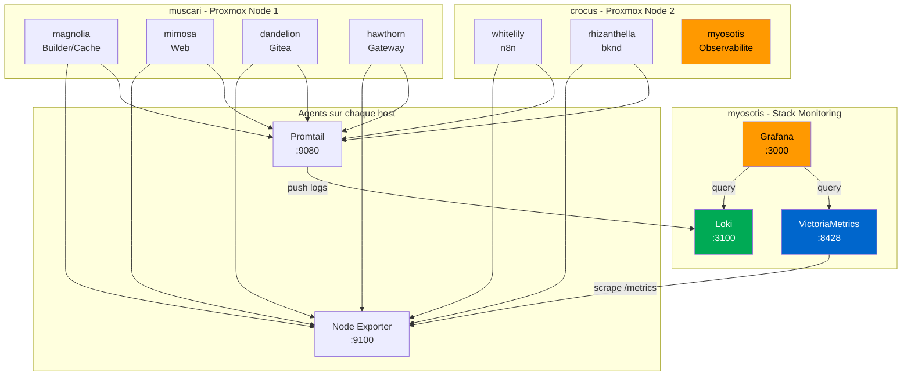

# Plan : Myosotis - Plateforme d'Observabilité

## Objectif

Centraliser logs et métriques de toute l'infrastructure (hawthorn, mimosa, dandelion, whitelily, rhizanthella, magnolia) sur une VM dédiée "myosotis". Accessible via HTTPS sur Tailscale avec Grafana comme interface unique.

---

## Architecture

### Flux de données

- **Métriques** : Node Exporter expose `/metrics` sur `:9100` → VictoriaMetrics scrape toutes les 15s
- **Logs** : Promtail lit les journaux systemd → push vers Loki sur myosotis:3100
- **Visualisation** : Grafana requête Loki (LogQL) et VictoriaMetrics (PromQL)

---

## Composants

### Node Exporter (sur chaque host)
- **Rôle** : Expose les métriques système (CPU, RAM, disque, réseau) en format Prometheus
- **Port** : 9100 (écoute uniquement sur Tailscale)
- **Poids** : ~10 Mo RAM, négligeable en CPU

### Promtail (sur chaque host)
- **Rôle** : Collecte les logs systemd et les envoie à Loki
- **Port** : 9080 (HTTP health check)
- **Config** : Lit le journal systemd, ajoute des labels (hostname, unit)

### Loki (sur myosotis)
- **Rôle** : Stockage et indexation des logs. Alternative légère à Elasticsearch
- **Port** : 3100
- **Rétention** : 30 jours
- **Stockage** : Filesystem local (`/var/lib/loki`)

### VictoriaMetrics (sur myosotis)
- **Rôle** : TSDB pour métriques. Remplacement drop-in de Prometheus, plus léger
- **Port** : 8428
- **Rétention** : 12 mois
- **Stockage** : Filesystem local (`/var/lib/victoriametrics`)

### Grafana (sur myosotis)
- **Rôle** : Interface web de visualisation. Dashboards, alertes, exploration
- **Port** : 3000 (accès HTTPS via Tailscale Serve sur myosotis)
- **Auth** : Admin local + accès Tailscale uniquement

---

## Qui installe quoi

| Composant        | myosotis | magnolia | hawthorn | mimosa | dandelion | whitelily | rhizanthella | muscari | crocus |
|------------------|----------|----------|----------|--------|-----------|-----------|--------------|---------|--------|
| Grafana          | ✅       |          |          |        |           |           |              |         |        |
| Loki             | ✅       |          |          |        |           |           |              |         |        |
| VictoriaMetrics  | ✅       |          |          |        |           |           |              |         |        |
| Node Exporter    | ✅       | ✅       | ✅       | ✅     | ✅        | ✅        | ✅           | (P8b)   | (P8b)  |
| Promtail         | ✅       | ✅       | ✅       | ✅     | ✅        | ✅        | ✅           |         |        |
| Tailscale Serve  | ✅       |          |          |        |           |           |              |         |        |
| **OS**           | NixOS    | NixOS    | NixOS    | NixOS  | NixOS     | NixOS     | NixOS        | Debian  | Debian |

---

## Legende de suivi (a garder a jour)

- **Phase active:** `P8b`
- **Derniere tache terminee:** `T42b`
- **Prochaine tache:** `T39b` (monitoring Proxmox nodes)
- **Dernier commit:** `3acfe68 - chore(myosotis): set alert repeat interval to 24h`
- **Deploiement:** tous les hosts NixOS deployes, 6/7 targets UP (rhizanthella offline)
- **P9 termine:** dashboards, SMTP Gmail, Slack, 5 alert rules provisionnees
- **Date maj:** `2026-02-09`

---

## P1 - Scaffolding myosotis (host NixOS)

- [x] **T01** Ajouter myosotis dans `install-hosts.tsv`
  **depends_on:** -
  **test:** `grep myosotis scripts/install-hosts.tsv`
  **commit:** `feat(myosotis): add host to install-hosts.tsv`

- [x] **T02** Creer `hosts/myosotis/configuration.nix` (base minimale)
  **depends_on:** -
  **test:** `cat hosts/myosotis/configuration.nix`
  **commit:** `feat(myosotis): scaffold configuration.nix`

- [x] **T03** Ajouter myosotis dans `flake.nix` (nixosConfigurations)
  **depends_on:** `T02`
  **test:** `nix flake show | grep myosotis`
  **commit:** `feat(myosotis): add nixosConfiguration to flake`

- [x] **T04** Ajouter myosotis dans `.sops.yaml`
  **depends_on:** -
  **test:** `grep myosotis .sops.yaml`
  **commit:** `chore(myosotis): add sops creation rule`

- [x] **T05** Ajouter myosotis dans `config.nix` (tailscale.hosts, placeholder)
  **depends_on:** -
  **test:** `grep myosotis config.nix`
  **commit:** `chore(myosotis): add tailscale host placeholder`

- [x] **T06** Tester l'evaluation du flake
  **depends_on:** `T03`
  **test:** `nix flake show` sans erreur
  **commit:** -

- [x] **T07** Commit Phase 1
  **depends_on:** `T01`-`T06`
  **test:** `git log --oneline -1`
  **commit:** `ef5d7a0 - feat(myosotis): scaffold observability host`

---

## P2 - Creer la VM dans Proxmox

- [x] **T08** Creer la VM myosotis dans Proxmox (2 CPU, 2 Go RAM, 32 Go disque)
  **depends_on:** `T07`
  **test:** VM visible dans l'interface Proxmox
  **commit:** -

- [x] **T09** Installer NixOS depuis l'ISO custom
  **depends_on:** `T08`
  **test:** `ssh myosotis` OK
  **commit:** -
  **note:** 1er essai echoue (secrets/myosotis.yaml manquant), retry OK apres ajout du fichier

- [x] **T10** Generer `hardware-configuration.nix` et le committer
  **depends_on:** `T09`
  **test:** `cat hosts/myosotis/hardware-configuration.nix`
  **commit:** `d2a792e - chore(myosotis): add hardware-configuration.nix` (pushe depuis la VM)

- [x] **T11** Copier la cle sops age sur la VM
  **depends_on:** `T09`
  **test:** `test -f /var/lib/sops-nix/key.txt`
  **commit:** -

- [x] **T12** Premier `nixos-rebuild switch --flake .#myosotis`
  **depends_on:** `T10`, `T11`
  **test:** `hostname` retourne `myosotis`
  **commit:** - (fait par le script d'install)

- [x] **T13** Mettre a jour l'IP Tailscale dans `config.nix`
  **depends_on:** `T12`
  **test:** `ping myosotis` depuis un autre host
  **commit:** `chore(myosotis): set tailscale IP in config.nix`

---

## P3 - VictoriaMetrics sur myosotis

- [x] **T14** Activer `services.victoriametrics` dans configuration.nix
  **depends_on:** `T12`
  **test:** `curl http://myosotis:8428/health`
  **commit:** `37d4a2d - feat(myosotis): enable victoriametrics with 12m retention`
  **note:** 1er rebuild a casse la VM (mauvais UUID boot partition), fix dans b189801

- [x] **T15** Configurer retention 12 mois (`-retentionPeriod=12`)
  **depends_on:** `T14`
  **test:** verifier dans les args du service
  **commit:** (inclus dans T14)

- [x] **T16** Ouvrir le port 8428 uniquement sur Tailscale
  **depends_on:** `T14`
  **test:** `curl` depuis host Tailscale OK, refuse depuis WAN
  **commit:** (inclus dans T14)

- [x] **T17** Tester l'ecriture/lecture de metriques
  **depends_on:** `T14`
  **test:** `curl -d 'test_metric{host="marigold"} 42' http://myosotis:8428/api/v1/import/prometheus` puis query OK
  **commit:** -

---

## P4 - Node Exporter sur myosotis (premier host)

- [x] **T18** Creer le module NixOS `modules/monitoring/node-exporter.nix`
  **depends_on:** -
  **test:** fichier existe et syntaxe valide
  **commit:** `b2122d2 - feat(myosotis): add node-exporter module and scrape config`

- [x] **T19** Importer le module dans myosotis/configuration.nix
  **depends_on:** `T18`
  **test:** `curl http://myosotis:9100/metrics`
  **commit:** (inclus dans T18)

- [x] **T20** Ajouter le scrape job dans VictoriaMetrics
  **depends_on:** `T14`, `T19`
  **test:** metriques `node_*` visibles dans VM
  **commit:** (inclus dans T18)

- [x] **T21** Verifier les metriques dans VictoriaMetrics
  **depends_on:** `T20`
  **test:** `curl 'http://myosotis:8428/api/v1/query?query=node_cpu_seconds_total'` OK
  **commit:** -

---

## P5 - Loki sur myosotis

- [x] **T22** Activer `services.loki` dans configuration.nix
  **depends_on:** `T12`
  **test:** `curl http://myosotis:3100/ready` → `ready`
  **commit:** `9d498c9 - feat(myosotis): enable loki with 30d retention`
  **note:** 1er build echoue (delete-request-store manquant), fix dans 8b77fc8

- [x] **T23** Configurer retention 30 jours
  **depends_on:** `T22`
  **test:** config `retention_period: 720h` presente
  **commit:** (inclus dans T22)

- [x] **T24** Ouvrir le port 3100 uniquement sur Tailscale
  **depends_on:** `T22`
  **test:** acces OK depuis Tailscale, refuse depuis WAN
  **commit:** (inclus dans T22)

---

## P6 - Promtail sur myosotis (premier host)

- [x] **T25** Creer le module NixOS `modules/monitoring/promtail.nix`
  **depends_on:** -
  **test:** fichier existe et syntaxe valide
  **commit:** `5fd0ede - feat(myosotis): add promtail module and enable on myosotis`
  **note:** 2 fix necessaires (sandboxing systemd) : 9788d4a et 523e041

- [x] **T26** Importer le module dans myosotis/configuration.nix
  **depends_on:** `T22`, `T25`
  **test:** `systemctl is-active promtail` → active
  **commit:** (inclus dans T25)

- [x] **T27** Verifier les logs dans Loki
  **depends_on:** `T26`
  **test:** `curl 'http://myosotis:3100/loki/api/v1/labels'` → host, job, unit OK
  **commit:** -

---

## P7 - Grafana sur myosotis

- [x] **T28** Activer `services.grafana` dans configuration.nix
  **depends_on:** `T12`
  **test:** `curl http://myosotis:3000/api/health` → OK
  **commit:** `f5b4021 - feat(myosotis): add grafana with datasources and caddy HTTPS`

- [x] **T29** Configurer les datasources Loki et VictoriaMetrics
  **depends_on:** `T22`, `T14`, `T28`
  **test:** datasources vertes dans Grafana
  **commit:** (inclus dans T28, provisioning declaratif)

- [x] **T30** Exposer Grafana en HTTPS via Tailscale Serve (remplace Caddy)
  **depends_on:** `T28`
  **test:** `https://myosotis.inanga-sirius.ts.net` → cadenas vert, login OK
  **commit:** `9432f29 - refactor(myosotis): replace caddy with tailscale serve for grafana HTTPS`

- [x] **T31** Configurer le mot de passe admin via sops
  **depends_on:** `T28`
  **test:** login avec le mot de passe sops OK
  **commit:** `d0e37e5 - feat(myosotis): configure grafana admin password via sops`
  **note:** grafana.db supprime manuellement car le mot de passe etait deja stocke en base

- [x] **T32** Importer le dashboard Node Exporter Full (#1860)
  **depends_on:** `T29`
  **test:** dashboard affiche CPU/RAM/disque
  **commit:** `bb9b9ff - feat(myosotis): provision node exporter full dashboard (#1860)`

---

## P8 - Deployer monitoring sur tous les hosts

- [x] **T33** Ajouter Node Exporter + Promtail sur hawthorn
  **depends_on:** `T18`, `T25`
  **test:** metriques et logs hawthorn dans Grafana
  **commit:** (inclus dans commit P8 global)

- [x] **T34** Ajouter Node Exporter + Promtail sur mimosa
  **depends_on:** `T18`, `T25`
  **test:** metriques et logs mimosa dans Grafana
  **commit:** (inclus dans commit P8 global)

- [x] **T35** Ajouter Node Exporter + Promtail sur dandelion
  **depends_on:** `T18`, `T25`
  **test:** metriques et logs dandelion dans Grafana
  **commit:** (inclus dans commit P8 global)

- [x] **T36** Ajouter Node Exporter + Promtail sur whitelily
  **depends_on:** `T18`, `T25`
  **test:** metriques et logs whitelily dans Grafana
  **commit:** (inclus dans commit P8 global)

- [x] **T37** Ajouter Node Exporter + Promtail sur rhizanthella
  **depends_on:** `T18`, `T25`
  **test:** metriques et logs rhizanthella dans Grafana
  **commit:** (inclus dans commit P8 global)

- [x] **T38** Ajouter Node Exporter + Promtail sur magnolia
  **depends_on:** `T18`, `T25`
  **test:** metriques et logs magnolia dans Grafana
  **commit:** (inclus dans commit P8 global)
  **note:** magnolia est NixOS (builder/cacher), pas Proxmox. Les nodes Proxmox (muscari, crocus) necessitent une approche pkgsStatic separee

- [x] **T39** Ajouter tous les scrape targets dans VictoriaMetrics
  **depends_on:** `T33`-`T38`
  **test:** tous les hosts visibles dans Grafana
  **commit:** (inclus dans commit P8 global)

---

## P8b - Monitoring des nodes Proxmox (muscari, crocus)

Les nodes Proxmox tournent sous Debian (pas NixOS). On utilise `pkgs.pkgsStatic`
pour compiler des binaires statiques autonomes et les deployer via SSH.

- [ ] **T39b** Creer `scripts/deploy-proxmox.nix` (binaires statiques + deploy SSH)
  **depends_on:** `T18`
  **test:** `nix run .#deploy-proxmox` deploie sur un node
  **commit:** `feat(monitoring): add proxmox deploy script with static binaries`
  **note:** utilise pkgsStatic.prometheus-node-exporter pour un binaire sans dependances

- [ ] **T39c** Ajouter muscari et crocus dans monitoredHosts
  **depends_on:** `T39b`
  **test:** metriques muscari et crocus visibles dans Grafana
  **commit:** `feat(monitoring): add proxmox nodes to monitored hosts`

- [ ] **T39d** (optionnel) Ajouter pve-exporter pour metriques Proxmox API
  **depends_on:** `T39c`
  **test:** metriques `pve_*` dans Grafana (backups, statut VMs)
  **commit:** `feat(monitoring): add proxmox pve-exporter`

---

## P9 - Dashboards et alertes

- [x] **T40** Dashboard "Vue d'ensemble infrastructure" (#11074)
  **depends_on:** `T39`
  **test:** dashboard affiche tous les hosts avec vue multi-host
  **commit:** `01280ee - feat(myosotis): provision infrastructure overview dashboard (#11074)`
  **note:** dashboard patche au build (sed) pour remplacer datasource variable par UID stable

- [x] **T41** Logs Explorer (natif Grafana Explore)
  **depends_on:** `T39`
  **test:** Grafana > Explore > Loki → logs visibles par host/service
  **commit:** - (fonctionnalite native, pas de provisioning necessaire)

- [x] **T42** Configurer SMTP Gmail + Slack dans Grafana
  **depends_on:** `T28`
  **test:** email de test recu, notification Slack recue
  **commit:** `0c33ed6 - feat(myosotis): configure grafana SMTP, email and slack contact points`
  **note:** 4 secrets sops (gmail/from, gmail/app_password, gmail/to, slack/webhook_url). Politique : critical→email+slack, reste→slack. Repeat interval 24h.

- [x] **T42b** Alertes provisionnees (5 regles)
  **depends_on:** `T42`, `T39`
  **test:** alerte "Host unreachable" firing pour rhizanthella, email+slack recus
  **commit:** `add7b08 - feat(myosotis): add 5 provisioned alert rules for infrastructure monitoring`
  **note:** disk>80% (critical), RAM>90% (warning), CPU>90% (warning), host unreachable (critical), reboot detected (info)

---

## P10 - Metriques applicatives (optionnel)

- [ ] **T43** Exporter metriques Caddy (hawthorn)
  **depends_on:** `T33`
  **test:** metriques `caddy_*` dans Grafana
  **commit:** `feat(hawthorn): expose caddy metrics`

- [ ] **T44** Exporter metriques Gitea (dandelion)
  **depends_on:** `T35`
  **test:** metriques `gitea_*` dans Grafana
  **commit:** `feat(dandelion): expose gitea metrics`

- [ ] **T45** Exporter metriques PostgreSQL (dandelion, whitelily, rhizanthella)
  **depends_on:** `T35`, `T36`, `T37`
  **test:** metriques `pg_*` dans Grafana
  **commit:** `feat(monitoring): add postgres exporter`

- [ ] **T46** Dashboard applicatif par service
  **depends_on:** `T43`-`T45`
  **test:** dashboards specifiques disponibles
  **commit:** `feat(myosotis): provision application dashboards`

---

## P11 - Hardening et documentation

- [ ] **T47** Backup configuration Grafana (dashboards, datasources)
  **depends_on:** `T40`
  **test:** restaurer depuis backup
  **commit:** `feat(myosotis): add grafana backup`

- [ ] **T48** Rate limiting sur les endpoints Loki
  **depends_on:** `T39`
  **test:** test avec charge elevee
  **commit:** `chore(myosotis): add loki rate limiting`

- [ ] **T49** Documenter l'architecture dans le README
  **depends_on:** -
  **test:** README a jour
  **commit:** `docs(myosotis): document observability architecture`

- [ ] **T50** Runbook : que faire quand une alerte fire
  **depends_on:** `T42`
  **test:** document lisible et actionnable
  **commit:** `docs(myosotis): add alerting runbook`

---

## Checklist de pilotage (a chaque fin de tache)

- [ ] Les tests de la tache sont passes localement
- [ ] Le scope de la tache est reste petit
- [ ] Le commit est fait avec le message propose (ou equivalent)
- [ ] La section "Legende de suivi" en haut est mise a jour
- [ ] La prochaine tache est claire et prete a etre lancee

---

## Ressources estimees pour la VM

| Ressource | Minimum | Recommandé |
|-----------|---------|------------|
| CPU       | 2 vCPU  | 2 vCPU     |
| RAM       | 2 Go    | 4 Go       |
| Disque    | 32 Go   | 64 Go      |

Calcul disque :
- Loki (30j logs, ~6 hosts) : ~5-10 Go
- VictoriaMetrics (12 mois, ~6 hosts) : ~5-10 Go
- Grafana : ~500 Mo
- OS + paquets : ~10 Go
- Marge : ~10-30 Go
